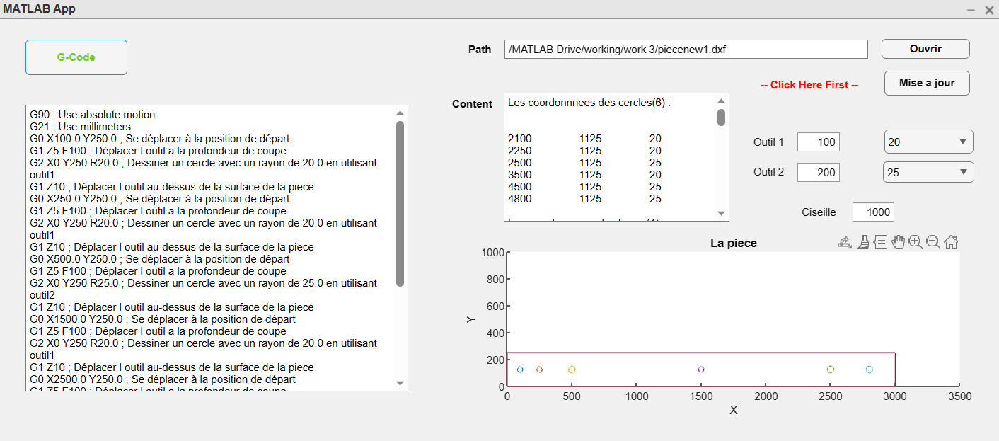

# MatlabCAM

# MATLAB AppDesigner DXF Circle Analyzer

## Description

This repository contains a MATLAB App Designer application that analyzes DXF files and extracts information about circles, including their radii and center positions. The application provides visualizations of the extracted data in the form of graphs and offers the flexibility to choose the placement of three tools. Additionally, it generates G-Code based on the analyzed circles.

Included in this repository is the sample DXF file [`piecenew1.dxf`](piecenew1.dxf) for testing and demonstration purposes.

## Features

- **DXF file analysis:** Extracts circle information from DXF files.
- **Circle data visualization:** Illustrates graphs displaying circle radii and center positions.
- **Tool placement selection:** Allows users to choose the placement of three tools.
- **G-Code generation:** Generates G-Code based on the analyzed circle data.

## Usage

1. Clone or download the repository.
2. Open the MATLAB AppDesigner application file.
3. Load the [`piecenew1.dxf`](piecenew1.dxf) file or replace it with your own DXF file.
4. Run the application to analyze the circles, view the graphs, select tool placements, and generate G-Code.

Feel free to explore the code, customize the application, and adapt it to your specific needs.

Please note that this application is provided as-is, and any usage or modification is at your own risk.

Enjoy analyzing DXF files and extracting circle data with MATLAB AppDesigner!

## Screenshots

Add any relevant screenshots or images showcasing your application here.

